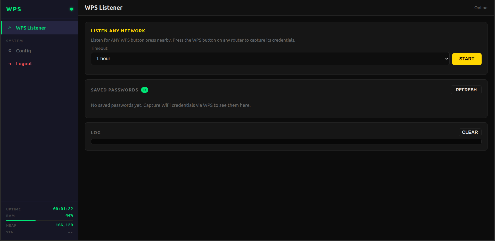
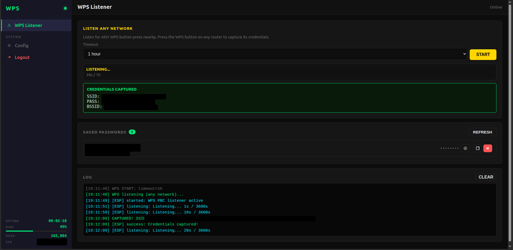

If you wanna help me

<a href="https://www.buymeacoffee.com/daboynb" target="_blank"></a>

# wps-catcher




Pocket WPS auditing tool built on a $3 ESP32. Plug it in, connect your phone to its Wi-Fi, open the page that pops up, hit start — when someone presses the WPS button on a nearby router, the board grabs the credentials.

## What it does

Power it up and the board becomes its own little Wi-Fi hotspot called `wps-catcher`. Connect any phone or laptop and a captive-portal page opens automatically (same as airport / hotel Wi-Fi). From that page you start a WPS listener: when anyone within range presses the WPS button on their router, the board completes the handshake and captures SSID + password + BSSID. Saved on the board for later.

Ready to use about 7 seconds after power-on. Runs off any USB power bank.

## Flashing

Plug the board in, then:

```bash
./flash.sh
```

That's it. The script auto-detects the board and the USB port, erases the chip, flashes the firmware, uploads the web UI, and opens the serial monitor.

Requirements: [PlatformIO Core](https://platformio.org/install/cli) installed.

## Using it

1. Power the board.
2. Connect your phone to the `ESP32-Tool` Wi-Fi (default password: `esp32tool!`).
3. Login page opens by itself (if not go to http://192.168.4.1). Default web password: `esp32tool!`.
4. Pick a timeout, hit **Start**, wait for a WPS button press on a nearby router.
5. On capture, SSID + password + BSSID show up on screen and are stored on the board.
